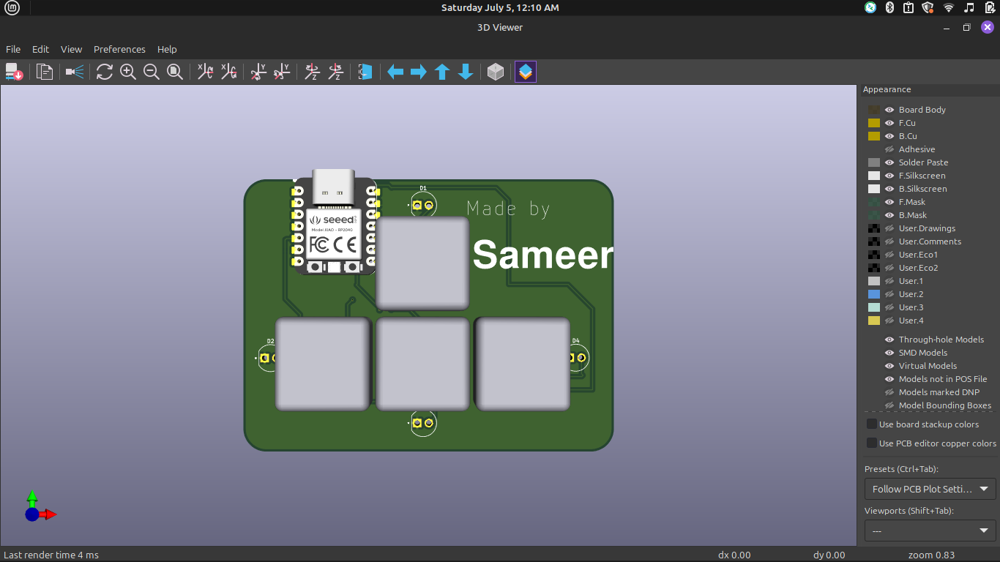
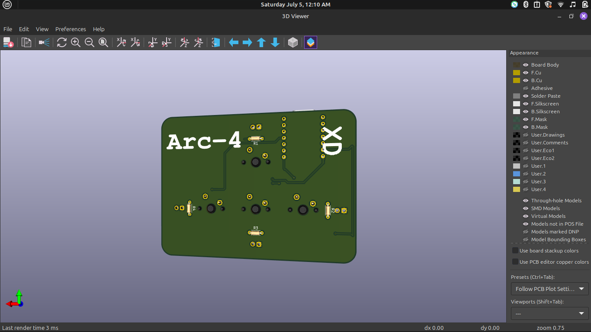

# ⌨️ Arc-4
---
#### A simple and compact macropad built using **4 Cherry MX switches**, a custom PCB, and the **Seeed Studio XIAO RP2040**.
---

## ✨ Features

- 4 programmable mechanical keys (Cherry MX compatible)
- Custom-designed PCB
- XIAO RP2040 microcontroller
- Simple and clean Arduino firmware
- Easy USB-C connectivity
- LED support for each key

---

## 📦 Parts List

- 1 × Seeed Studio **XIAO RP2040**
- 4 × **Cherry MX** mechanical switches 
- 4 × Keycaps
- 1 × Custom PCB
- 4 × 220Ω resistors
- USB-C Cable
- Soldering tools

---

## 🖼️ Images

Add your macropad photos or PCB renders here:

- 
- 

