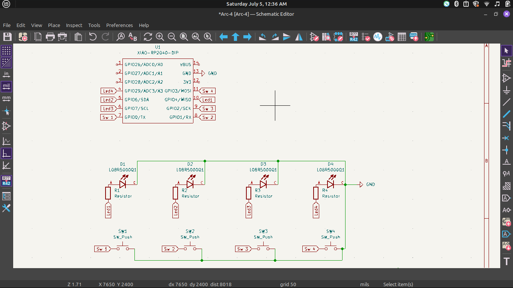

# ____________________________________Arc-4_________________________________
#### A simple and compact Guessing Game built using **4 Cherry MX switches**, a custom PCB, and the **Seeed Studio XIAO RP2040**.

## Working
This Gamepad generates a random 3-bit(0,1) code and  you guess it using 3 buttons. Pressing a fourth button checks your guess and LEDs light up solid if correct or blink if wrong.

## Features
- 4 mechanical keys
- Custom-designed PCB
- XIAO RP2040 microcontroller
- Simple and clean Arduino firmware
- Easy USB-C connectivity
- LED support for each key

##  Parts List

- 1 × Seeed Studio **XIAO RP2040**
- 4 × **Cherry MX** mechanical switches 
- 4 × Keycaps
- 1 × Custom PCB
- 4 × resistors
- USB-C Cable

## Images

- 
- 
- 

